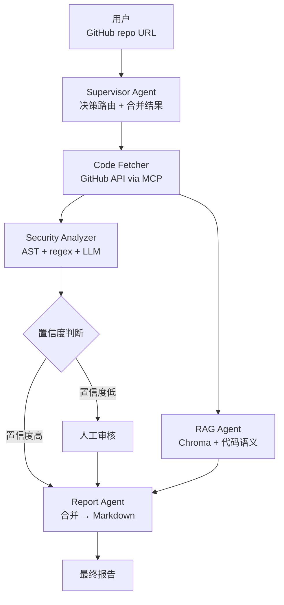

```mermaid
graph TD
    User["用户\nGitHub repo URL"] --> Supervisor["Supervisor Agent\n决策路由 + 合并结果"]
    Supervisor --> CodeFetcher["Code Fetcher\nGitHub API via MCP"]
    CodeFetcher --> SecurityAnalyzer["Security Analyzer\nAST + regex + LLM"]
    CodeFetcher --> RAGAgent["RAG Agent\nChroma + 代码语义"]
    SecurityAnalyzer --> HITLCheck{"置信度判断"}
    HITLCheck -- 置信度低 --> HumanReview["人工审核"]
    HITLCheck -- 置信度高 --> ReportAgent["Report Agent\n合并 → Markdown"]
    HumanReview --> ReportAgent
    RAGAgent --> ReportAgent
    ReportAgent --> Output["最终报告"]
```